# Load_Balancer_And_Auto_Scaling_Group_In_AWS  

# TASK 1. Create Launch Template :
1. Log into te aws management console.

2. Navigate to the EC2 service .

3. in the left navigation pane, click on launch tamplate

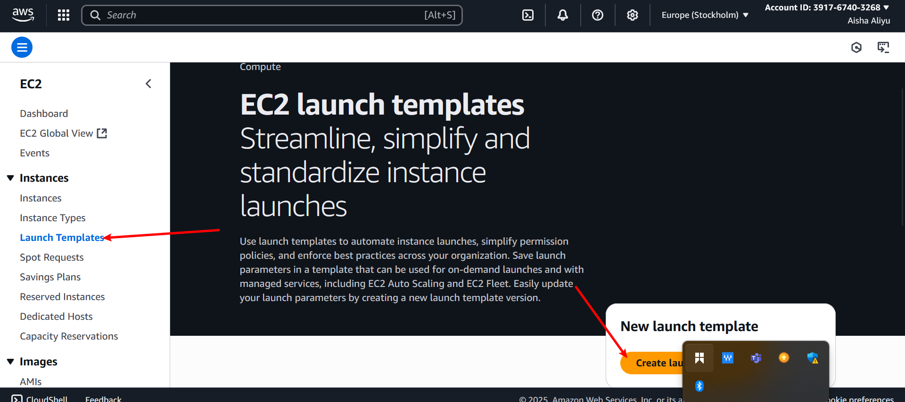.

4. click the create launch template  button
5. configure the launch template setting , including the AMI , instance type, and user data.
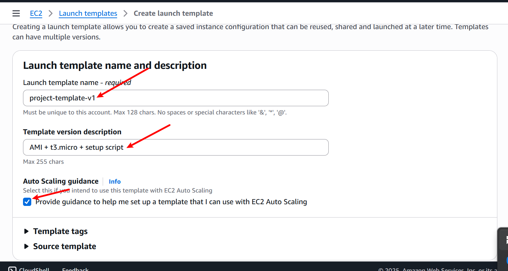

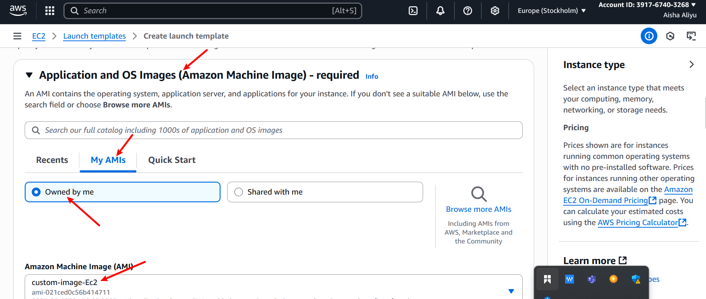.

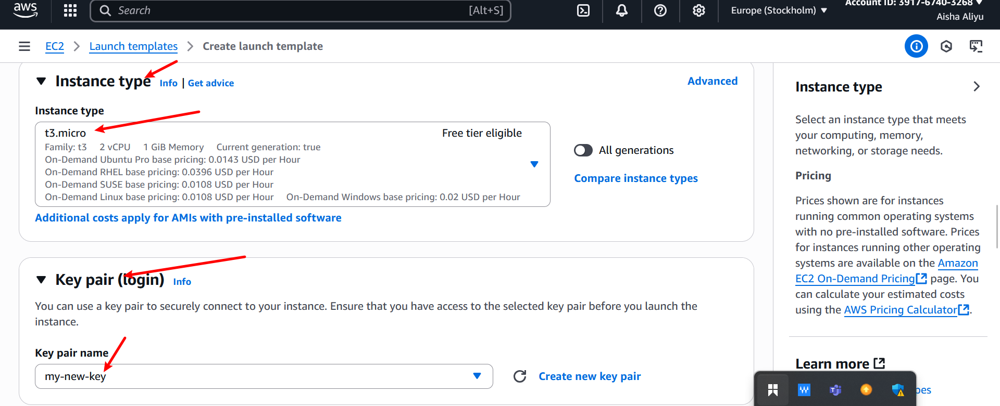.

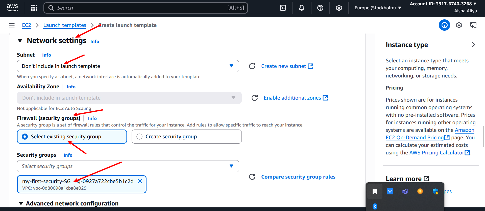.

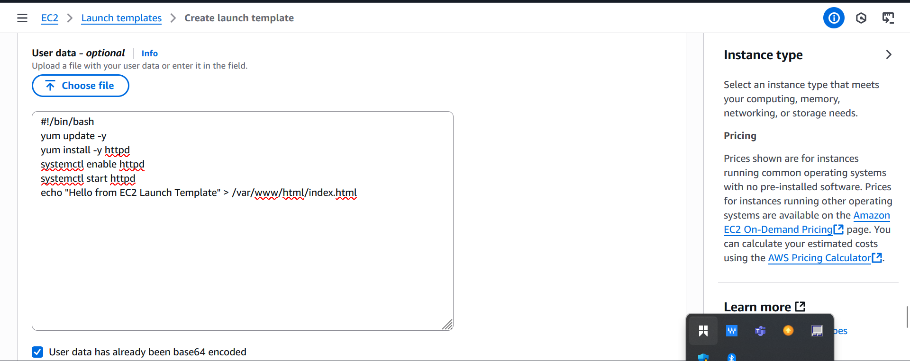.

# TASK 2. SET UP AUTO SCALING GROUP:
1. In the aws managemant console, navigate to the ec2 service.

2. click on auto scaling group

3. click the ctreate auto scaling group button.
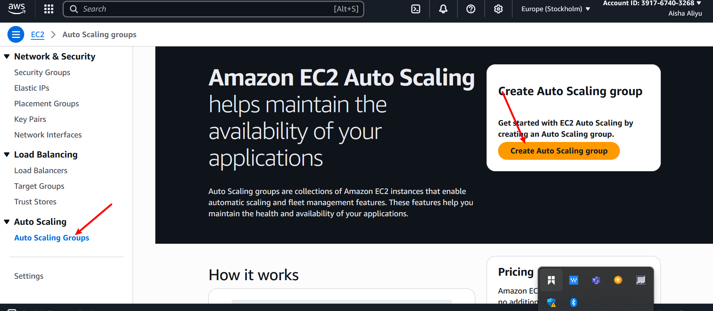.

4. choose use launch template and select the launch template created .

5. configure the auto scaling group setting , including the group name, desired capacity and innitial instance .
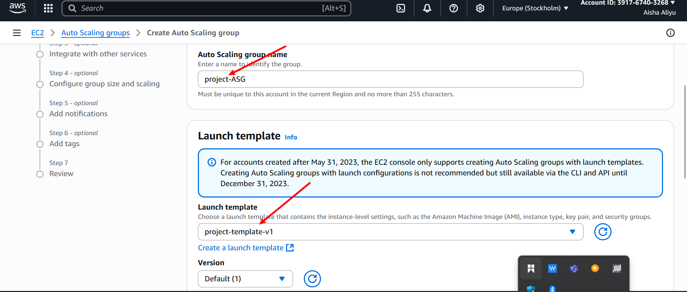

6. set up additional configuration suh as netwrok setting , subnets, and scaling policies.
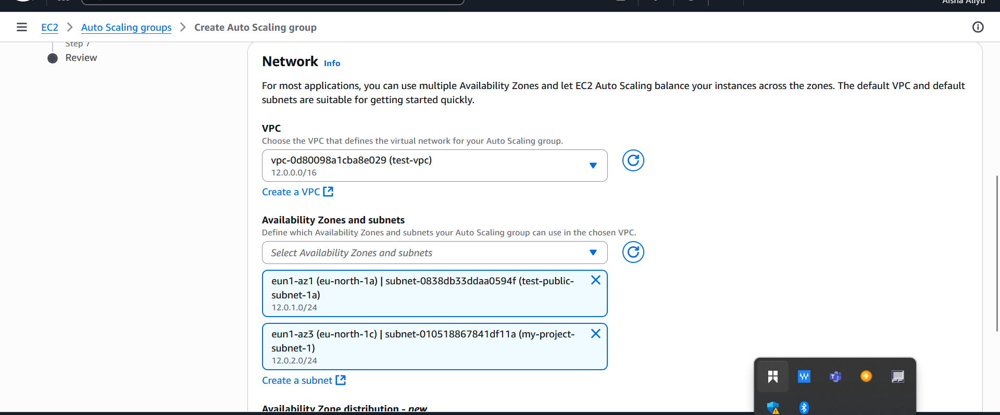.

Now , you have successfully created an Auto  scaling group.
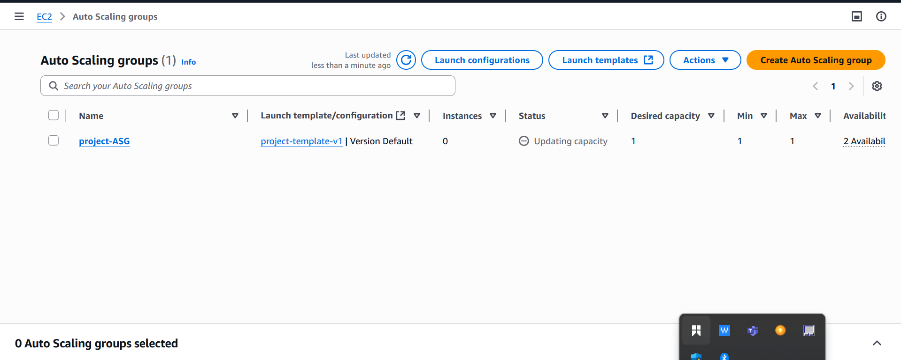.

# TASK 3. Configure Scaling Policies.
1. In the Auto scaling group configuration, navigate to the scaling policies section.

2. Click on create scaling policy and configure policies for scaling in and scaling out based on demand .
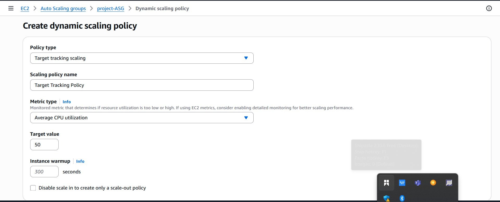.

# TASK 4. Attach ALB To Auto scaling Group:
1. In the auto scaling group configuration, navigate to the load balancing section.
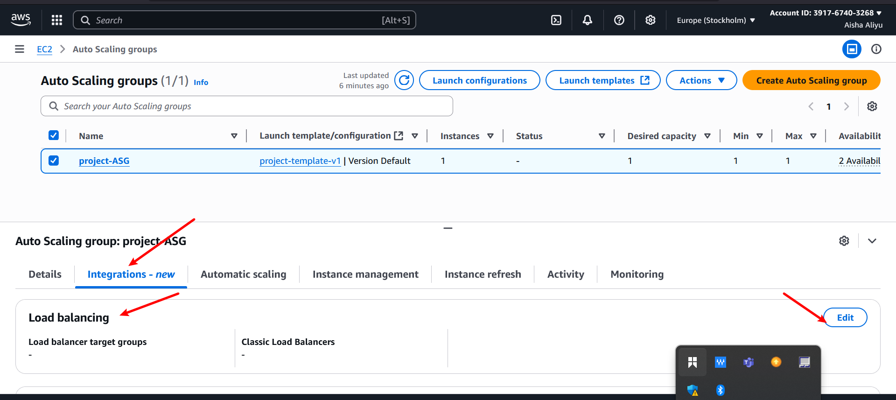

2. click om Edit and select the ALB to associate with the autro scaling group.

# TESTING AUTO SCALLING
1. Generate traffic to trigger scaling policy
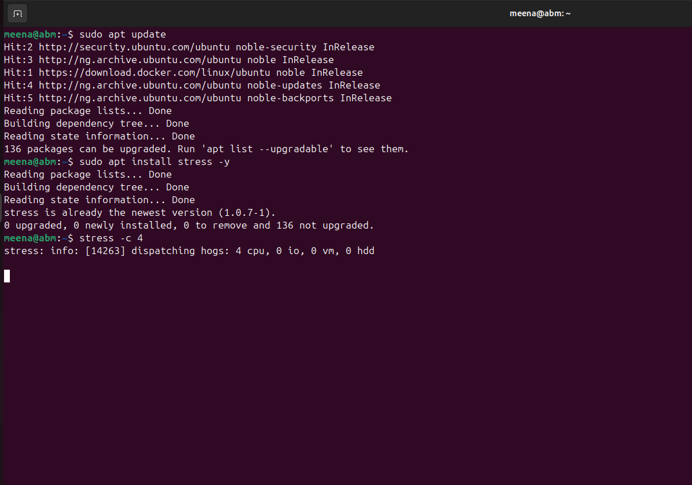.

2. monitor the autor scaling group and verify that the number instances adjusts based on demand .

